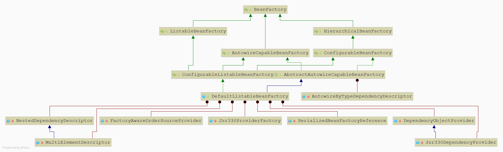
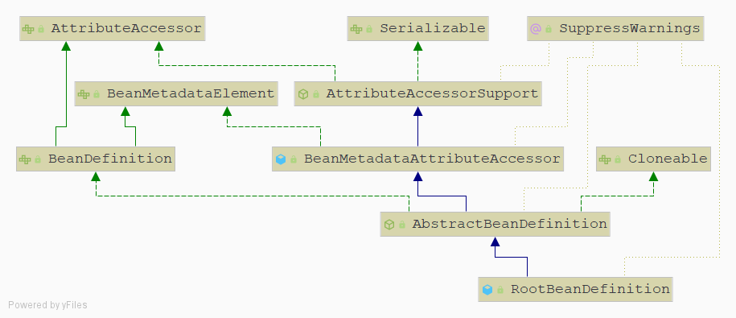

# Spring IOC

[TOC]

## BeanFactory

BeanFactory类图

`BeanFactory`主要有三个实现接口`ListableBeanFactory`,`HierarchicalBeanFactory`, `AutowireCapableBeanFactory`

`BeanFactory`的默认实现类是`DefaultListableBeanFactory`

| 类                         | 说明                   |
| -------------------------- | ---------------------- |
| ListableBeanFactory        | 定义Bean是可列表化的   |
| HierarchicalBeanFactory    | 定义Bean是有继承关系的 |
| AutowireCapableBeanFactory | 定义Bean的自动转配规则 |

## BeanDefinition

Spring IOC容器管理定义的Bean对象及其相互的关系, Bean对象在Spring中的是通过BeanDefinition来描述的

## IOC容器初始化

IOC容器初始化可以大致分为 ==定位==， ==加载==，==注册==三个部分。

`AbstractApplicationContext.refresh()`IOC容器开始定位配置文件

在`refresh()`方法中执行 `ConfigurableListableBeanFactory beanFactory = obtainFreshBeanFactory();`后，开始创建容器，加载BeanDeinition

在`DefaultBeanDefinitionDocumentReader.doRegisterBeanDefinitions`执行后，开始根据BeanDefinition，通过初始化策略来创建Bean（BeanWrapper）,注册到IOC容器中。

